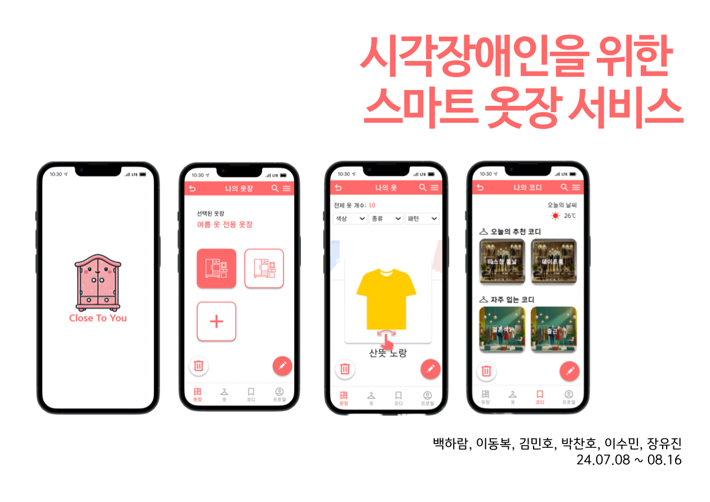
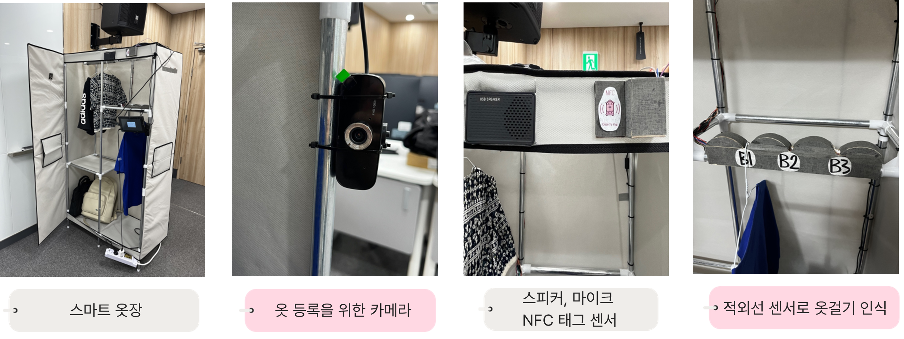
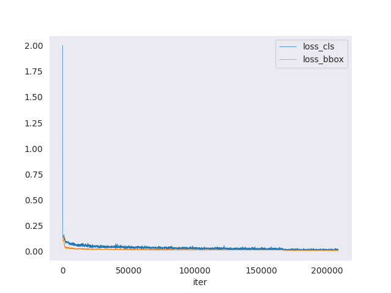
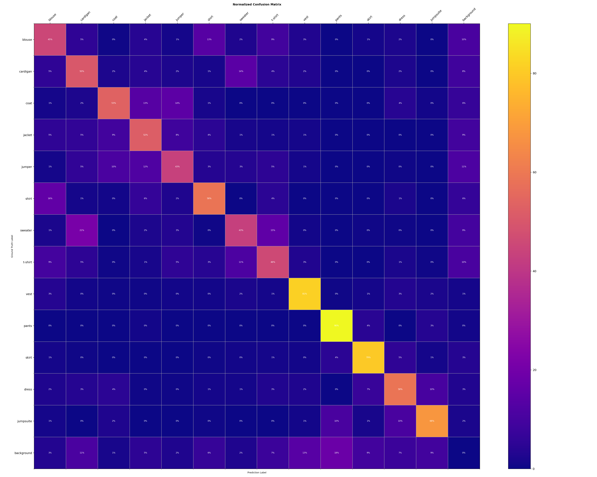
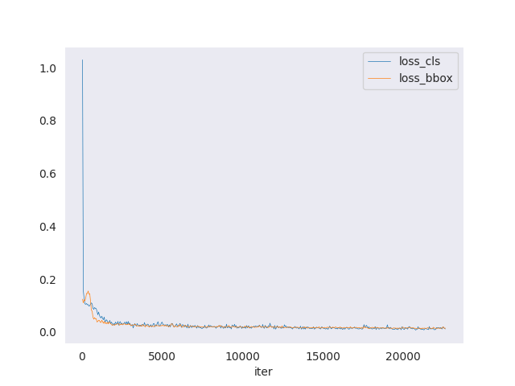
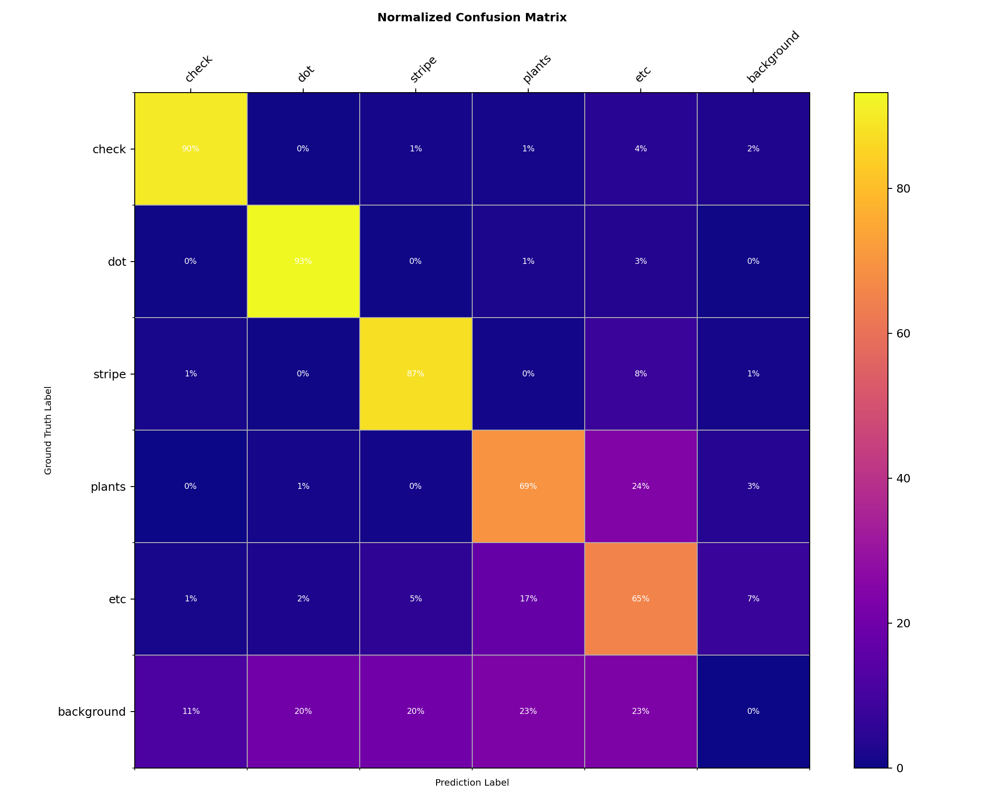

# 💛 Close To You 💛
## 시각장애인을 위한 스마트 AI 옷장 서비스👨🏼‍🦯

# 👋🏻 프로젝트 소개

1. 시각장애인의 옷의 색상, 종류, 패턴 인식의 어려움
2. 시각장애인의 옷의 위치 파악의 어려움
3. 시각장애인의 옷 정보 체계적 관리 어려움

위와 같은 어려움을 겪는 시각 장애인을 위해 온디바이스 AI와 IoT 기술을 결합한 **스마트 AI 옷장 서비스**를 기획하게 되었습니다.

## 📹️ 실제 시각장애인 분들의 불편함을 담은 인터뷰 영상이 담긴 UCC 영상
[보러  가기](https://youtu.be/OaMLsVygSZY)

## 🌟 주요 기능

- 적외선 센서, NFC 태그 등 IoT 센서와 AI 기술을 사용한 옷 위치, 옷 정보 저장
- 음성 인식 기술과 음성 안내  기술로 원하는 옷의 위치를 파악하여 안내
- NFC 태깅을 통해 나만의 코디 저장, 편리한 옷 정보 파악

# 🤝🏼 팀원 구성 및 역할
| 백하람 | 박찬호 | 이동복 | 김민호 | 이수민 | 장유진                      |                                             
| ---- | ----- | ---- | ---- | ---- | ----- | 
|  |  |  | |  |  |
| [@ramrami-B](https://github.com/ramrami-B) | [@Chaeros](https://github.com/Chaeros) | [@Dongbok-Lee](https://github.com/Dongbok-Lee) | [@km9494](https://github.com/km9404) | [@sumin305](https://github.com/sumin305) | [@YuJin-it](https://github.com/YuJin-it)

**🐿️ 백하람(Harper): 팀장, 프론트엔드, AI**

**🤖 박찬호(Beyonce): 백엔드, IoT**

**🐯 이동복(Tiger): 백엔드, IoT**

**🐶 김민호(Michael): 프론트엔드**

**🐰 이수민(Daisy): 백엔드, UCC**

**🐱 장유진(Tania): 프론트엔드, IoT**

# ⚒️ 기술 스택
### 🦄 프론트엔드
코어 `React` `Vite` `SWC`

CSS `Emotion`

상태 관리 `Zustand`

### 🦾 백엔드

프레임워크 `SpringBoot`

주요 라이브러리 `SpringSecurity` `Lombok` 등

### ⚙︎ 인프라

CI/CD `Jenkins`

배포 `docker` `docker-compose` `aws` `nginx`

# 🤙 컨벤션

[**🚩팀 깃 컨벤션**](https://classic-molecule-29c.notion.site/cd99a1d9ae8c480ea8ccc2ad521ea011?pvs=4)

[**🦄프론트엔드 코딩 컨벤션**](https://classic-molecule-29c.notion.site/a6ec100c97564531a81d89ce721fe6aa?pvs=4)

[**🦾백엔드 코딩 컨벤션**](https://classic-molecule-29c.notion.site/50d4e77f80b8448b894b48fb0494a628?pvs=4)

# 🏗️ 시스템 아키텍쳐

# 💡 기획 및 설계

[**🔬GitLab**](https://lab.ssafy.com/s11-webmobile3-sub2/S11P12B201)

[**➰Figma**](https://www.figma.com/design/4456hl8FPBySNidhnv9JVI/%EA%B8%B0%EA%B0%80%EC%B0%A8%EB%85%B8~?node-id=0-1&t=uZoIp1dLZHTihtHN-1)

[**💼Jira**](https://ssafy.atlassian.net/jira/software/c/projects/S11P12B201/boards/7090)

💽[**ERD**](https://www.erdcloud.com/d/TvvSLbKd2qr6xqLmr)

[**✍️요구사항 명세서**](https://classic-molecule-29c.notion.site/02f41ba9f56844c08e693170619fac19?pvs=4)

[**✍️기능 명세서**](https://classic-molecule-29c.notion.site/2e3f64a5ddbf4d2c89d8837a53fa8ed9?pvs=4)

# 하드웨어 결과물(IoT)

# 🤖 AI 성능 지표
## 옷 종류 구분

**Accuracy: 0.9405**

| Class | Precision | Recall | F1 Score |
| --- | --- | --- | --- |
| blouse | 0.5046 | 0.5062 | 0.5054 |
| cardigan | 0.4875 | 0.5552 | 0.5192 |
| coat | 0.6194 | 0.5756 | 0.5967 |
| jacket | 0.5213 | 0.5777 | 0.5481 |
| jumper | 0.5392 | 0.4907 | 0.5138 |
| shirt | 0.6164 | 0.6294 | 0.6228 |
| sweater | 0.5525 | 0.4766 | 0.5118 |
| t-shirt | 0.4970 | 0.5158 | 0.5062 |
| vest | 0.7743 | 0.8257 | 0.7992 |
| pants | 0.8156 | 0.9087 | 0.8596 |
| skirt | 0.7860 | 0.8304 | 0.8076 |
| dress | 0.6586 | 0.6083 | 0.6324 |
| jumpsuite | 0.7708 | 0.6964 | 0.7317 |

## 옷 패턴 구분

Accuracy: 0.9310

| Class | Precision | Recall | F1 Score |
| --- | --- | --- | --- |
| check | 0.9511 | 0.9262 | 0.9385 |
| dot | 0.9455 | 0.9366 | 0.9410 |
| stripe | 0.9060 | 0.8896 | 0.8977 |
| plants | 0.7681 | 0.7257 | 0.7463 |
| etc | 0.6406 | 0.7059 | 0.6716 |
